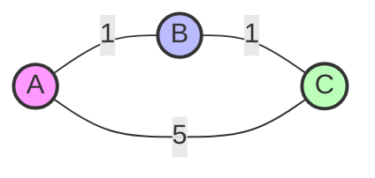
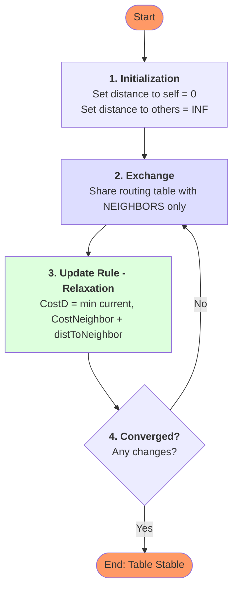

# Distance Vector Routing (DVR)

The **Distance Vector Routing** algorithm is a dynamic routing protocol where each router maintains a table (Vector) of the minimum distance to every possible destination in the network.

---

## 🗺️ Network Topology
This simulation uses the following directed graph:



---

## 🧩 Algorithm (Bellman-Ford)
To memorize for **15 marks**, remember these 4 steps:



### The Formula
$$\text{Cost}(R,D) = \min_{N \in Neighbors} \big( \text{Cost}(R,N) + \text{Cost}(N,D) \big)$$

---

## 📝 Program Algorithm (Python Implementation)
Follow these logical steps as implemented in the code:

1.  **Initialize Topology**: Define the network as an adjacency matrix (dictionary of dictionaries) called `graph`.
2.  **Initialize Tables**: Create a deep copy of the `graph` as `tables` to store routing information.
3.  **Iteration Loop (Distance Vector Routine)**:
    *   Run a loop for a fixed number of iterations (e.g., 5).
    *   Set a flag `updated = False`.
4.  **Triple Nested Loop (The Core Logic)**:
    *   For each `router` in the network:
        *   For each `destination` in the tables:
            *   For each `neighbor` of the current router:
                *   Calculate `new_cost = cost(router, neighbor) + cost(neighbor, destination)`.
                *   If `new_cost` < `tables[router][destination]`:
                    *   Update the table with `new_cost`.
                    *   Set `updated = True`.
5.  **Convergence Check**:
    *   If `updated` is `False` at the end of an iteration, terminate the loop (Convergence achieved).
6.  **Display**: Printing the updated tables after each iteration.

---

## 🖥️ Python Simulation

```python
import copy
import time

INF = 999  # Represent infinity

# Define network topology (adjacency matrix)
graph = {
    'A': {'A': 0, 'B': 1, 'C': 5},
    'B': {'A': 1, 'B': 0, 'C': 1},
    'C': {'A': 5, 'B': 1, 'C': 0}
}

# Initialize distance vector tables
tables = copy.deepcopy(graph)

def print_tables(step):
    print(f"\n--- Routing Tables after iteration {step} ---")
    for router, table in tables.items():
        print(f"{router}: {table}")

def distance_vector_routing(iterations=5):
    for step in range(1, iterations+1):
        updated = False
        for router in tables:
            for dest in tables[router]:
                for neighbor in graph[router]:
                    new_cost = graph[router][neighbor] + tables[neighbor][dest]
                    if new_cost < tables[router][dest]:
                        tables[router][dest] = new_cost
                        updated = True
        print_tables(step)
        time.sleep(1)
        if not updated:
            print("\n✅ Convergence achieved!")
            break

if __name__ == "__main__":
    print("Initial Routing Tables:")
    print_tables(0)
    distance_vector_routing()
```

---

## 📊 Example Output
```
Initial Routing Tables:
A: {'A': 0, 'B': 1, 'C': 5}
B: {'A': 1, 'B': 0, 'C': 1}
C: {'A': 5, 'B': 1, 'C': 0}

--- Routing Tables after iteration 1 ---
A: {'A': 0, 'B': 1, 'C': 2}
B: {'A': 1, 'B': 0, 'C': 1}
C: {'A': 2, 'B': 1, 'C': 0}

✅ Convergence achieved!
```
