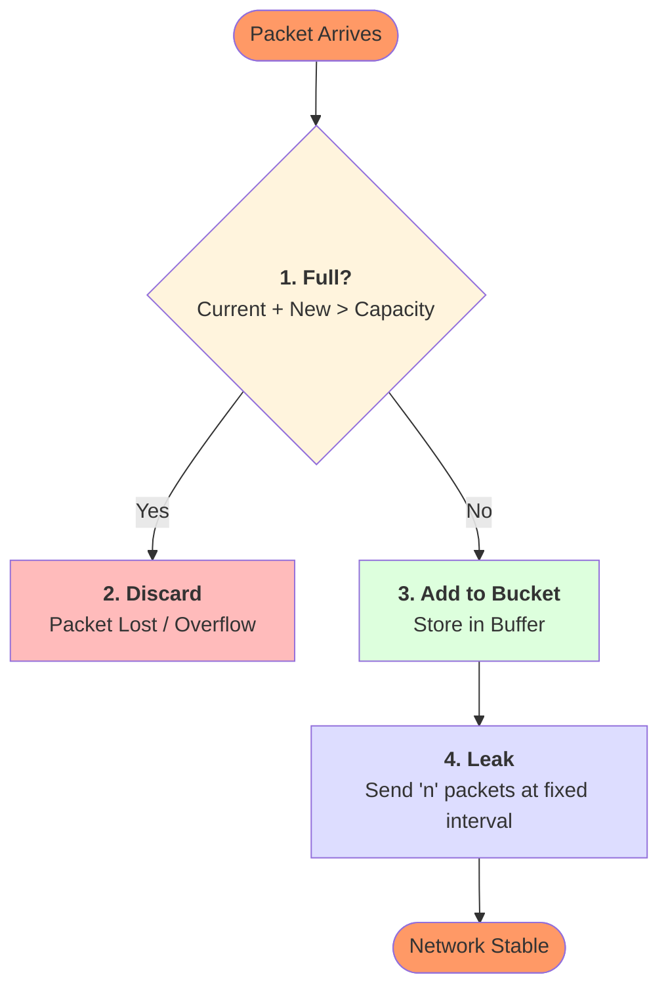

# Leaky Bucket Algorithm

The **Leaky Bucket** algorithm is used for traffic shaping and congestion control. It converts an irregular flow of packets into a predictable, fixed-rate output.

---

## 🌊 Concept
The algorithm is based on the analogy of a bucket with a hole:
- **Inputs**: Water (packets) arrives at any speed.
- **Buffer**: The bucket stores water (packets) up to a limit.
- **Output**: Water (packets) leaks out at a **constant rate**.
- **Overflow**: If the bucket is full, new water (packets) is **discarded**.

## 📝 Program Algorithm (Python Implementation)
The program is implemented using a `LeakyBucket` class with two primary methods:

1.  **Initialization (`__init__`)**:
    *   Set `capacity` (bucket size) and `leak_rate` (output rate).
    *   Initialize `bucket` (current packets) to 0.
2.  **Add Packet (`add_packet`)**:
    *   **Logic**: If `current_bucket_level` + `new_packets` > `capacity`:
        *   Print "Bucket overflow" and discard the packets.
    *   **Else**:
        *   Increment `bucket` level by the number of new packets.
3.  **Leak Process (`leak`)**:
    *   **Logic**: If `bucket` has packets (> 0):
        *   Calculate `leaked = min(leak_rate, bucket_level)`.
        *   Decrement `bucket` level by the `leaked` amount.
    *   **Else**:
        *   Print "Bucket empty".
4.  **Simulation Loop**:
    *   Iterate through a time-series (e.g., 1 to 10).
    *   Generate a random number of incoming packets.
    *   Call `add_packet(incoming)` followed by `leak()`.

---

## ⚙️ Workflow Diagram
Memorize this flow for the exam:



---

## 🚦 Applications
- **Traffic shaping**: Smooths out bursts before entering the network.
- **Congestion control**: Prevents routers from being overloaded.
- **QoS (Quality of Service)**: Ensures fair bandwidth distribution.

---

## 🖥️ Python Simulation

```python
import time
import random

class LeakyBucket:
    def __init__(self, capacity, leak_rate):
        self.capacity = capacity      # bucket size
        self.leak_rate = leak_rate    # packets per second
        self.bucket = 0               # current packets in bucket

    def add_packet(self, packets=1):
        if self.bucket + packets > self.capacity:
            print(f"❌ Bucket overflow! {packets} packet(s) discarded.")
        else:
            self.bucket += packets
            print(f"📥 Added {packets} packet(s). Bucket: {self.bucket}/{self.capacity}")

    def leak(self):
        if self.bucket > 0:
            leaked = min(self.leak_rate, self.bucket)
            self.bucket -= leaked
            print(f"💧 Leaked {leaked} packet(s). Bucket: {self.bucket}/{self.capacity}")
        else:
            print("⏳ Bucket empty, nothing to leak.")

# Simulation
if __name__ == "__main__":
    bucket = LeakyBucket(capacity=10, leak_rate=2)

    for t in range(1, 6):  # simulate 5 time units
        print(f"\n--- Time {t} ---")
        incoming = random.randint(0, 5)
        bucket.add_packet(incoming)
        bucket.leak()
        time.sleep(1)
```
