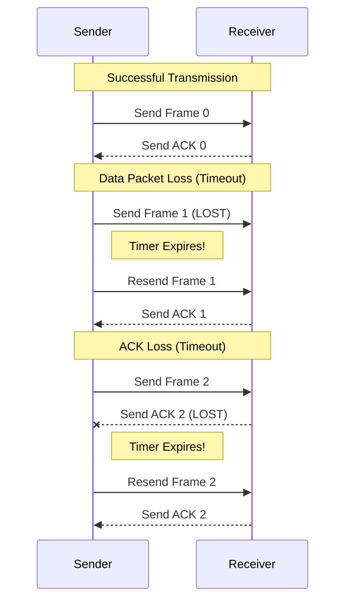

# Stop-and-Wait ARQ Protocol

The **Stop-and-Wait** protocol is a fundamental flow control and error control mechanism. The sender sends one frame and waits for an acknowledgement (ACK) before sending the next.

---

## ⚙️ How It Works
1. **Send**: Sender transmits a frame.
2. **Wait**: Sender starts a timer and waits for ACK.
3. **Success**: If ACK arrives before timeout, send the next frame.
4. **Resend**: If timeout occurs, resend the same frame.

## 📝 Program Algorithm (Python Implementation)
The system consists of two separate programs communicating over TCP sockets:

### **Server Logic (`start_server`)**:
1.  **Setup**: Create a TCP socket, bind it to localhost:65432, and listen for 1 connection.
2.  **Accept**: Accept an incoming connection from the client.
3.  **Receive Loop**:
    *   Receive a data frame from the client.
    *   **Simulate Reliability**:
        *   Generate a random choice (True/False).
        *   If True: Send an "ACK for Frame" back to the client.
        *   If False: Print "ACK lost" (do nothing).
4.  **Cleanup**: Close the connection once the client finishes.

### **Client Logic (`start_client`)**:
1.  **Setup**: Create a TCP socket and connect to the server.
2.  **Transmission Loop**:
    *   For each `frame` in the frame list:
        *   **Retransmission Loop**:
            *   Send the frame to the server.
            *   Set a `timeout` of 3 seconds using `client_socket.settimeout(3)`.
            *   **Receive ACK**:
                *   Try to receive an ACK.
                *   If successful: Break the inner loop and move to the next frame.
                *   If `socket.timeout` occurs: Print "Timeout" and repeat the inner loop.
3.  **Cleanup**: Close the socket when all frames are acknowledged.

---

### Sequence Diagram (Exam Logic)


---

## 🖥️ Python Simulation

### Server (`server_stop_wait.py`)
```python
import socket
import time
import random

def start_server():
    host = '127.0.0.1'
    port = 65432

    server_socket = socket.socket(socket.AF_INET, socket.SOCK_STREAM)
    server_socket.bind((host, port))
    server_socket.listen(1)
    print(f"Server listening on {host}:{port}...")

    conn, addr = server_socket.accept()
    print(f"Connected by {addr}")

    while True:
        data = conn.recv(1024).decode()
        if not data: break

        print(f"📥 Received frame: {data}")

        # Simulate ACK loss (50% chance)
        if random.choice([True, False]):
            ack = f"ACK for {data}"
            conn.sendall(ack.encode())
            print(f"✅ Sent: {ack}")
        else:
            print(f"⚠️ ACK for {data} lost (simulated)")

    conn.close()

if __name__ == "__main__":
    start_server()
```

### Client (`client_stop_wait.py`)
```python
import socket
import time

def start_client():
    host = '127.0.0.1'
    port = 65432

    client_socket = socket.socket(socket.AF_INET, socket.SOCK_STREAM)
    client_socket.connect((host, port))

    frames = ["Frame 0", "Frame 1", "Frame 2"]

    for frame in frames:
        while True:
            print(f"🚀 Sending: {frame}")
            client_socket.sendall(frame.encode())

            client_socket.settimeout(3) # 3s Timeout
            try:
                ack = client_socket.recv(1024).decode()
                print(f"📩 Received: {ack}")
                break # Success!
            except socket.timeout:
                print(f"⏰ Timeout! Resending {frame}...")

    client_socket.close()

if __name__ == "__main__":
    start_client()
```
