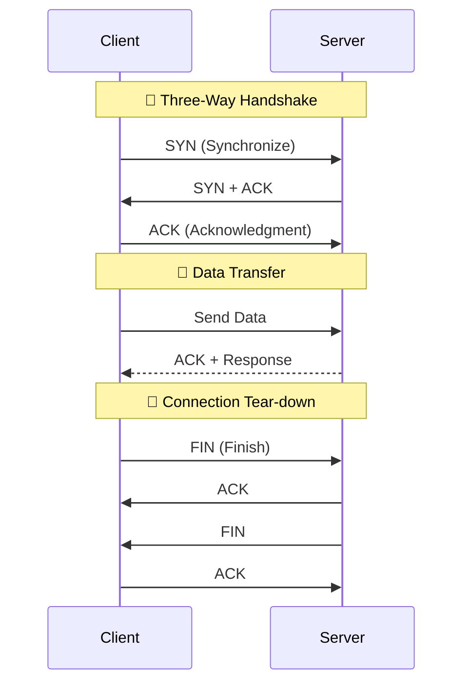

# TCP Client-Server Communication

TCP (Transmission Control Protocol) is a connection-oriented protocol that ensures reliable, ordered, and error-checked delivery of data.

---

## ⚙️ The Three-Way Handshake
Before any data is exchanged, TCP establishes a connection using a 3-step process.



---

## 📝 Program Algorithm (Python Implementation)
The program demonstrates a basic synchronous TCP connection using Python's `socket` module.

### **Server Side Steps**:
1.  **Initialize Socket**: Create a TCP/IP socket (`AF_INET`, `SOCK_STREAM`).
2.  **Bind**: Attach the socket to a specific local address (`127.0.0.1`) and port (`65432`).
3.  **Listen**: Set the server to listen mode to wait for incoming connection requests.
4.  **Accept Loop**:
    *   Wait and accept a connection from a client (`accept()`).
    *   **Receive**: Read data sent by the client.
    *   **Process**: Print the received data.
    *   **Respond**: Send a "Hello" response back to the client.
    *   **Close**: Terminate the individual client connection.

### **Client Side Steps**:
1.  **Initialize Socket**: Create a TCP/IP socket.
2.  **Connect**: Establish a connection to the server's IP and port.
3.  **Send**: Transmit a message string to the server.
4.  **Receive**: Wait for and read the response sent by the server.
5.  **Close**: Close the socket to release resources.

---

## 🖥️ Python Simulation

### Server Code (`server.py`)
```python
import socket

def start_server():
    server_socket = socket.socket(socket.AF_INET, socket.SOCK_STREAM)
    host = '127.0.0.1'
    port = 65432
    server_socket.bind((host, port))

    server_socket.listen(1)
    print(f"Server listening on {host}:{port}...")

    while True:
        conn, addr = server_socket.accept()
        print(f"Connected by {addr}")

        data = conn.recv(1024).decode()
        if not data: break
        print(f"Received from client: {data}")

        response = f"Hello Client, I received: {data}"
        conn.sendall(response.encode())
        conn.close()

if __name__ == "__main__":
    start_server()
```

### Client Code (`client.py`)
```python
import socket

def start_client():
    client_socket = socket.socket(socket.AF_INET, socket.SOCK_STREAM)
    host = '127.0.0.1'; port = 65432
    client_socket.connect((host, port))

    message = "Hello Server, this is Client!"
    client_socket.sendall(message.encode())

    data = client_socket.recv(1024).decode()
    print(f"Received from server: {data}")

    client_socket.close()

if __name__ == "__main__":
    start_client()
```

---

## ⚙️ How to Run
1. Run the server first: `python3 server.py`
2. Run the client: `python3 client.py`
3. The client connects (Handshake), sends data, and closes.
